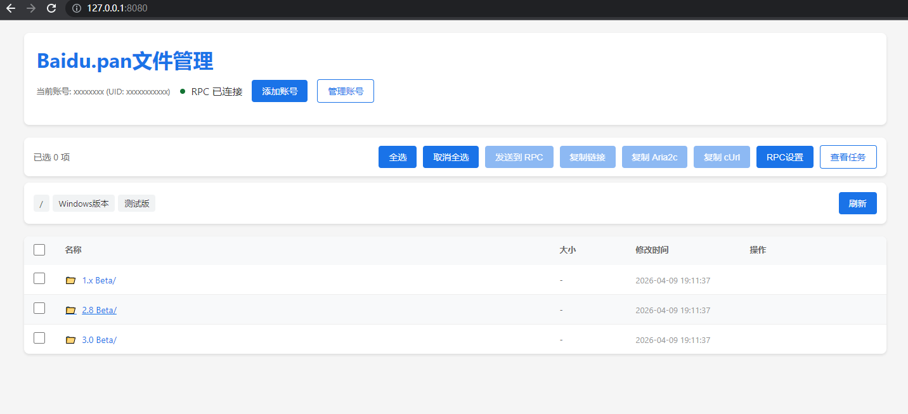

# BaiduPCS-Go Web

[English](#english) | [中文](#中文)

---

## English

### BaiduPCS-Go Web - Browser-based Baidu Netdisk Manager

A web-based Baidu Netdisk management tool with built-in download capabilities - no browser extensions required.



### Features

- **File Browsing** - Browse directories, view file info (size, modified time)
- **Direct Download** - Download files directly with multi-threaded acceleration
- **PCS Download** - Use BaiduPCS command-line download for better compatibility
- **Third-party Tools** - Support Aria2, IDM and other download managers via RPC/API
- **Progress Display** - Real-time download progress in Web UI
- **Download Panel** - Floating panel to monitor all download tasks
- **Pause/Resume** - Pause and resume downloads at any time
- **Download History** - Persistent download history
- **Multi-Account Support** - Manage multiple Baidu accounts

### Quick Start

1. **Create `server.json`:**
```json
{
    "enable_web": true,
    "enable_api": true,
    "web_port": 8080
}
```

2. **Start and visit:** http://localhost:8080

3. **Add account:**
   - Click "添加账号" (Add Account)
   - Enter your BDUSS
   - Click Login

4. **Download files:**
   - Click "直链下载" for direct download
   - Click "PCS下载" for BaiduPCS command download
   - Click "发送到RPC" to send to Aria2 or other RPC tools

### API Endpoints

| Endpoint | Method | Description |
|----------|--------|-------------|
| `/api/files` | GET | List files |
| `/api/files/download` | GET | Get direct download link |
| `/api/download` | POST | Create direct download task |
| `/api/download/run` | POST | Create PCS download task |
| `/api/download/status/:task_id` | GET | Get download status |
| `/api/download/list` | GET | List active tasks |
| `/api/download/pause/:task_id` | POST | Pause download |
| `/api/download/resume/:task_id` | POST | Resume download |
| `/api/download/cancel/:task_id` | POST | Cancel download |
| `/api/download/history` | GET | Get download history |
| `/api/login` | POST | Add account |
| `/api/users` | GET | List accounts |

### Tech Stack

- **Backend**: Go + Gin
- **Frontend**: Pure HTML/CSS/JavaScript
- **Downloader**: BaiduPCS + Aria2

### Related Projects

- [BaiduPCS-Go](https://github.com/qjfoidnh/BaiduPCS-Go) - Command-line version

### License

Apache License 2.0 - See [LICENSE](./LICENSE) for details.

---

## 中文

### 百度网盘 Web 管理器

基于 Web 界面的百度网盘管理工具，支持直链下载、PCS下载和第三方下载工具，无需浏览器插件。

### 功能特点

- **文件浏览** - 浏览目录，查看文件大小、修改时间
- **直链下载** - 多线程直链下载，实时显示进度
- **PCS下载** - 使用 BaiduPCS 命令下载，兼容性更好
- **第三方工具** - 支持 Aria2、IDM 等下载工具（RPC/API）
- **进度显示** - Web 界面实时显示下载进度
- **下载面板** - 浮动面板监控所有下载任务
- **暂停/恢复** - 随时暂停和恢复下载
- **下载历史** - 下载历史持久化存储
- **多账号支持** - 管理多个百度账号

### 快速开始

1. **创建 `server.json`：**
```json
{
    "enable_web": true,
    "enable_api": true,
    "web_port": 8080
}
```

2. **启动后访问：** http://localhost:8080

3. **添加账号：**
   - 点击「添加账号」
   - 输入 BDUSS
   - 点击登录

4. **下载文件：**
   - 点击「直链下载」直接下载
   - 点击「PCS下载」使用命令下载
   - 点击「发送到RPC」推送到 Aria2 等第三方工具

### API 接口

| 接口 | 方法 | 说明 |
|------|------|------|
| `/api/files` | GET | 获取文件列表 |
| `/api/files/download` | GET | 获取直链 |
| `/api/download` | POST | 创建直链下载任务 |
| `/api/download/run` | POST | 创建 PCS 下载任务 |
| `/api/download/status/:task_id` | GET | 获取任务状态 |
| `/api/download/list` | GET | 列出活动任务 |
| `/api/download/pause/:task_id` | POST | 暂停任务 |
| `/api/download/resume/:task_id` | POST | 恢复任务 |
| `/api/download/cancel/:task_id` | POST | 取消任务 |
| `/api/download/history` | GET | 获取下载历史 |
| `/api/login` | POST | 添加账号 |
| `/api/users` | GET | 获取账号列表 |

### 技术栈

- **后端**：Go + Gin
- **前端**：原生 HTML/CSS/JavaScript
- **下载器**：BaiduPCS + Aria2

### 相关项目

- [BaiduPCS-Go](https://github.com/qjfoidnh/BaiduPCS-Go) - 命令行版本

### 开源协议

Apache License 2.0 - 详见 [LICENSE](./LICENSE)
